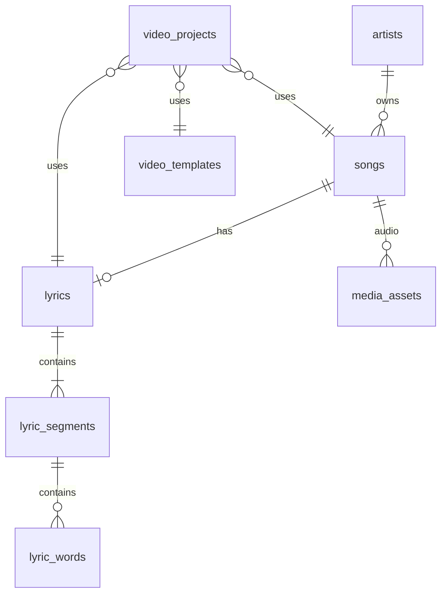

# AI Lyrics & Music Video Platform — Product Blueprint

Blueprint for the **React + TypeScript + PostgreSQL** application. Use this document to scope modules, APIs, database tables, workers, and frontend routes.

**Architectural principle:** Build **Song → Lyrics → Timings** first. Public library, karaoke, templates, exports, artist pages, and analytics all sit on that foundation.

**Product spec:** [PRODUCT.md](./PRODUCT.md) (Ugandan music, lyrics, lyric-video — full capability list).

**Monorepo layout (current):**

| Path | Role |
|------|------|
| `frontend/` | React, Vite, React Router, TanStack Query, Tailwind |
| `backend/` | Express, Prisma, Neon, BullMQ enqueue + workers |
| `frontend/src/pages/LrcStudioPage.tsx`, `CreateStudioPage.tsx`, `StudioEditorPage.tsx` | **Nyimba LRC** — React/TS UI (no Python) |
| `static/` | Archived legacy JS mockups only — **not used at runtime** |

---

## Technology stack

| Layer | Choices |
|-------|---------|
| **Frontend** | React, TypeScript, Vite, React Router, TanStack Query, Tailwind CSS |
| **Backend** | Node.js, TypeScript, Fastify |
| **Data** | PostgreSQL (Neon), Prisma ORM |
| **Jobs** | Redis, BullMQ |
| **AI / media** | Speech-to-text, language detection, FFmpeg, vocal separation, lyrics alignment, video rendering |
| **Storage** | Object storage (S3-compatible) for audio, video, images, renders; **PostgreSQL for metadata only** |

---

## Module map (19 modules)

Each module lists **purpose**, **primary actors**, **key entities**, **API/worker touchpoints**, and **Phase** (see [Build order](#build-order)).

### 1. Authentication & user management

| | |
|--|--|
| **Purpose** | Identity, sessions, roles, account lifecycle |
| **Actors** | Guest, User, Artist, Admin |
| **Features** | Sign up, login/logout, email verification, password reset, roles (`listener`, `artist`, `admin`), user profile, artist-linked profile, account settings |
| **Entities** | `users`, `sessions` / refresh tokens, `email_verification_tokens`, `password_reset_tokens` |
| **API** | `/auth/*`, `/users/me`, `/users/me/settings` |
| **Phase** | 1 |

### 2. Artist management

| | |
|--|--|
| **Purpose** | Artist dashboard and public artist identity |
| **Actors** | Artist, Admin |
| **Features** | Create/edit artist profile (name, bio, avatar, cover, socials, genre, location), manage songs/albums/lyrics/videos, statistics |
| **Entities** | `artists`, `artist_members` (team), links to `songs`, `albums`, `video_projects` |
| **API** | `/artists`, `/artists/:id`, `/artists/:id/dashboard` |
| **Phase** | 1 (profile + dashboard shell), 4 (public profile) |

### 3. Song management

| | |
|--|--|
| **Purpose** | Upload and catalog audio |
| **Actors** | Artist |
| **Features** | Upload audio, metadata (title, artist, album, genre, release date, cover, duration, description, credits), lyrics text (optional), language(s), draft/published |
| **Entities** | `songs`, `albums`, `song_artists`, `media_assets` (audio object key) |
| **API** | `/songs`, `/songs/:id`, `/songs/:id/publish`, presigned upload URLs |
| **Phase** | 1 |

### 4. Language detection

| | |
|--|--|
| **Purpose** | Detect and confirm language(s) per upload |
| **Actors** | System, Artist |
| **Flow** | Upload → analyze audio → detect language + confidence → artist confirms |
| **Catalog (initial)** | Luganda, English, Runyankole, Lusoga, Acholi, Lugisu, Lugwere, Swahili |
| **Mixed language** | Section-level tags (e.g. verse = Luganda, chorus = English) → `lyric_segments.language_code` |
| **Entities** | `languages`, `song_languages`, `lyric_segments.language_code` |
| **Workers** | `language.detect` |
| **Phase** | 2 |

### 5. AI lyrics transcription

| | |
|--|--|
| **Purpose** | Speech-to-text and structure from audio |
| **Actors** | System, Artist |
| **Features** | STT, multilingual (incl. Luganda), noise handling, vocal separation, repeat detection, verse/chorus/bridge hints, confidence scores |
| **Entities** | `lyrics`, `transcription_jobs`, raw STT output (JSON blob in object storage or `job.result`) |
| **Workers** | `audio.prepare`, `vocal.separate`, `transcription.run` |
| **Phase** | 2 |

### 6. Lyrics editor

| | |
|--|--|
| **Purpose** | Human correction of AI output |
| **Actors** | Artist, User (where allowed) |
| **Features** | Edit text, add/remove words, spelling, sections (verse/chorus/bridge), reorder, drafts, **Approve lyrics** |
| **Entities** | `lyrics`, `lyric_segments` (section type + order), status on `lyrics` |
| **API** | `/songs/:id/lyrics`, `/lyrics/:id/approve` |
| **Frontend** | Rich text / section blocks; maps to segment rows |
| **Phase** | 2 |

### 7. Lyrics synchronization

| | |
|--|--|
| **Purpose** | Timestamp alignment for karaoke (“every rhythm”) |
| **Actors** | Artist, System |
| **Features** | Sentence/word/karaoke timing, auto sync, manual adjust, playback sync, waveform editor |
| **Entities** | `lyric_segments` (line/sentence), `lyric_words` (`start_time`, `end_time`) |
| **Workers** | `alignment.run` (forced alignment / tap-sync import) |
| **Frontend** | Port/evolve existing LRC timeline + tap sync from `static/` |
| **Phase** | 2 |

**Core hierarchy (non-negotiable):**

```text
Song
 └── Lyrics (one active version per workflow; history optional)
      └── Lyric segments (verse, chorus, bridge, …)
            └── Lyric words
                  ├── start_time
                  └── end_time
```

### 8. Lyrics video generator

| | |
|--|--|
| **Purpose** | End-user video creation flow |
| **Actors** | User, Artist |
| **Flow** | Song → lyrics → template → customize → generate |
| **Features** | Generate from audio, upload MV + overlay, audio-only video, backgrounds, animated/karaoke modes, waveform, progress bar |
| **Entities** | `video_projects`, `render_jobs` |
| **Workers** | `video.render` |
| **Phase** | 3 |

### 9. Video templates

| | |
|--|--|
| **Purpose** | Data-driven designs, not hard-coded UI |
| **Initial set** | Classic Lyrics, Karaoke, Minimal, Animated Typography, Afrobeat, Gospel, Love/Romantic, Music Visualizer, Photo Lyrics, Music Video Overlay |
| **Customization** | Font, size, colors, highlight, position, animation, background, shadow, blur, transitions, timing |
| **Entities** | `video_templates` (JSON schema for layout + defaults) |
| **Phase** | 3 |

### 10. Video export

| | |
|--|--|
| **Purpose** | Platform-specific outputs |
| **Presets** | YouTube/Facebook 16:9, TikTok/Instagram 9:16, Square 1:1 |
| **Formats** | MP4, HD / Full HD (4K later) |
| **Entities** | `render_jobs` (preset, resolution, output asset key) |
| **Workers** | FFmpeg pipeline in `video.render` |
| **Phase** | 3 |

### 11. Public lyrics library

| | |
|--|--|
| **Purpose** | Discovery and song pages |
| **Actors** | Listener, Guest |
| **Features** | Search/browse by language, genre, album; recent/popular/new; song page with play + lyrics |
| **Entities** | Published `songs`, `lyrics` (public flag), aggregates |
| **API** | `/discover/*`, `/songs/:slug` (public) |
| **Phase** | 4 |

### 12. Artist-verified lyrics

| | |
|--|--|
| **Purpose** | Trust signal for official lyrics |
| **Status flow** | `ai_generated` → `artist_reviewed` → `artist_verified` |
| **UI** | “✓ Official lyrics — verified by artist” |
| **Entities** | `lyrics.status`, `lyrics.verified_at`, `lyrics.verified_by_user_id` |
| **Phase** | 4 (UI), ties to Module 6 approve action in Phase 2 |

### 13. Artist song claiming

| | |
|--|--|
| **Purpose** | Link real artists to catalog entries |
| **Flow** | Search artist → request verification → admin review → verified |
| **Entities** | `artist_verifications`, `artist_claims` |
| **Phase** | 5 (verification workflow), 4 (search artist) |

### 14. Artist dashboard

| | |
|--|--|
| **Purpose** | At-a-glance metrics |
| **MVP metrics** | Song count, lyrics count, videos, total views/plays |
| **Later** | Per-song views, lyrics views, downloads, popular songs, audience |
| **Entities** | `song_views`, `song_plays`, materialized stats or nightly rollups |
| **Phase** | 1 (counts), 5 (analytics) |

### 15. User / listener side

| | |
|--|--|
| **Purpose** | Consumption and light creation |
| **Features** | Search, read lyrics, listen, watch lyric videos, create lyric videos, save/follow/share, report incorrect lyrics, playlists |
| **Entities** | `playlists`, `playlist_songs`, `follows`, `reports` |
| **Phase** | 4–5 |

### 16. Search & discovery

| | |
|--|--|
| **Purpose** | Cross-entity search |
| **Scope** | Songs, artists, albums, lyrics, genres, languages |
| **Filters** | Language, genre, artist, year |
| **Implementation** | PostgreSQL `tsvector` first; OpenSearch/Meilisearch in Phase 5 if needed |
| **Phase** | 4 |

### 17. Media / file management

| | |
|--|--|
| **Purpose** | Upload pipeline and asset lifecycle |
| **Store in object storage** | MP3/audio, MP4, images, rendered videos, temp processing files |
| **Store in PostgreSQL** | Metadata, keys, MIME, size, checksum, owner, song/video FK |
| **Entities** | `media_assets`, `upload_sessions` |
| **API** | Presigned PUT, callback to register asset, virus scan hook (later) |
| **Phase** | 1 |

### 18. Background processing

| | |
|--|--|
| **Purpose** | Non-blocking AI and render |
| **Flow** | Upload → create job → queue → worker → process → storage → notify user |
| **Job types** | `audio.process`, `language.detect`, `vocal.separate`, `transcription.run`, `alignment.run`, `video.render`, `thumbnail.generate` |
| **Infra** | Redis + BullMQ; job status table or Redis + poll/WebSocket |
| **Phase** | 1 (queue shell), 2–3 (workers), 5 (scale-out workers) |

### 19. Admin dashboard

| | |
|--|--|
| **Purpose** | Platform operations |
| **Features** | Users, artists, songs, lyrics, videos, verification queue, reports, copyright, moderation, languages, templates, system stats |
| **Actors** | Admin only |
| **API** | `/admin/*` (RBAC) |
| **Phase** | 5 (full), 1 (minimal user list optional) |

---

## PostgreSQL — core tables (initial)

Implement incrementally. Canonical Prisma schema: `apps/api/prisma/schema.prisma` ([DATABASE.md](./DATABASE.md)).

| Table | Module(s) | Notes |
|-------|-----------|--------|
| `users` | 1 | email, password hash, role |
| `artists` | 2, 13 | public slug, profile fields, `owner_user_id` |
| `artist_verifications` | 13 | status, evidence, reviewed_by |
| `songs` | 3, 11 | status draft/published, `audio_asset_id`, duration |
| `albums` | 3 | optional grouping |
| `song_artists` | 3 | M:N credits |
| `languages` | 4 | ISO-ish code + display name (Luganda, …) |
| `lyrics` | 5, 6, 12 | version, status, verification state |
| `lyric_segments` | 6, 7 | section type, order, line text, optional `language_code`, line-level times |
| `lyric_words` | 7 | word, `start_time`, `end_time` |
| `video_templates` | 9 | name, slug, JSON config |
| `video_projects` | 8 | song, lyrics, template, user overrides JSON |
| `render_jobs` | 8, 10, 18 | preset, progress, output asset |
| `media_assets` | 17 | bucket, key, kind, mime, size |
| `playlists` / `playlist_songs` | 15 | |
| `song_views` / `song_plays` | 14, 15 | append-only events or aggregates |

**ER (timing model):**



---

## Frontend — route & feature modules

Organize `apps/web/src` by domain (aligns with React Router lazy routes):

```text
src/
  app/                 # providers, router, layout
  features/
    auth/              # Module 1
    artist/            # Modules 2, 14
    songs/             # Module 3
    language/          # Module 4 (confirm UI)
    transcription/     # Module 5 (job status)
    lyrics-editor/     # Module 6
    sync-editor/       # Module 7 (waveform, tap sync)
    video-studio/      # Modules 8–10
    library/           # Module 11
    search/            # Module 16
    playlists/         # Module 15
    admin/             # Module 19
  shared/              # UI kit, hooks, api client
```

TanStack Query keys: `['song', id]`, `['lyrics', songId]`, `['job', jobId]`, `['artist', 'dashboard']`.

---

## API — service boundaries

| Service area | Responsibility |
|--------------|----------------|
| **Identity** | Auth, users, roles |
| **Catalog** | Artists, albums, songs, publish workflow |
| **Lyrics** | CRUD segments/words, approve, verification status |
| **AI pipeline** | Enqueue only; workers read/write assets + update lyrics |
| **Media** | Presigned URLs, asset registration |
| **Video** | Projects, templates, render enqueue |
| **Discovery** | Public read APIs, search |
| **Admin** | Verification, moderation |

Keep **AI and FFmpeg off the request thread** — API creates `render_jobs` / transcription job records and returns `job_id`.

---

## Background jobs (BullMQ queues)

| Queue | Worker | Module |
|-------|--------|--------|
| `audio` | normalize, probe duration, waveform peaks | 17, 5 |
| `language` | detect + section hints | 4 |
| `transcription` | STT + structure | 5 |
| `alignment` | word/line timestamps | 7 |
| `video` | template render, export presets | 8–10 |
| `media` | thumbnails | 18 |

Job record shape (API + DB): `id`, `type`, `status`, `progress`, `message`, `payload`, `result`, `error`, `user_id`, `song_id`.

Existing LRCGen jobs (`transcribe`, `isolate`, `enhanced`) map to **`transcription`** + **`alignment`** queues in Phase 2.

---

## Build order

### Phase 1 — Foundation

- [ ] Module 1: Auth (email/password, roles)
- [ ] Module 2: Artist profile + dashboard shell
- [ ] Module 3: Song upload + metadata + draft/publish
- [ ] Module 17: Object storage + `media_assets`
- [ ] Module 18: Job table + BullMQ wiring (stub workers)
- [ ] Prisma migrations on Neon for core catalog tables
- [ ] Module 14: Dashboard counts (static queries)

**Exit criteria:** Artist can sign up, create profile, upload a song, see it on dashboard.

### Phase 2 — AI & lyrics core

- [ ] Module 4: Language detection + confirm UI
- [ ] Module 5: Transcription pipeline (incl. vocal separation)
- [ ] Module 6: Lyrics editor + approve
- [ ] Module 7: Sync editor (segment + word times)
- [ ] Module 12: Verification states on approve
- [ ] Port/sync reuse from legacy `static/` editor

**Exit criteria:** Upload → detect language → transcribe → edit → sync words → approved lyrics with timings stored in PostgreSQL.

### Phase 3 — Video

- [ ] Module 9: Template registry
- [ ] Module 8: Video project wizard
- [ ] Module 10: Export presets (FFmpeg)
- [ ] Module 18: `video.render` workers

**Exit criteria:** Generate MP4 lyric video for at least one template and one aspect ratio.

### Phase 4 — Platform

- [ ] Modules 11, 15, 16: Public library, song pages, search, playlists
- [ ] Module 2: Public artist pages
- [ ] Module 12: Verified badge on public pages

### Phase 5 — Scale & trust

- [ ] Module 13: Artist claiming + admin verification
- [ ] Module 19: Admin dashboard
- [ ] Module 14: Full analytics
- [ ] CDN, caching, premium templates, subscriptions (product decision)

---

## Mapping from current LRCGen repo

| Today | Blueprint module |
|-------|------------------|
| `apps/api` transcribe/isolate/export | 5, 7, 18 |
| `static/` waveform + tap sync + timeline | 7 |
| In-memory jobs | 18 → PostgreSQL `render_jobs` / job store + BullMQ |
| `uploads/` folder | 17 → object storage keys in `media_assets` |
| Enhanced LRC word timestamps | `lyric_words` rows |

---

## Language catalogue (seed data)

Seed `languages` with at least:

| Code (app) | Display name |
|------------|----------------|
| `lg` | Luganda |
| `en` | English |
| `nyn` | Runyankole |
| `xog` | Lusoga |
| `ach` | Acholi |
| `xlu` | Lugisu |
| `lwg` | Lugwere |
| `sw` | Swahili |

Use BCP-47 where possible; app-specific codes OK if needed for STT model routing. Mixed-language songs: per-`lyric_segment.language_code`.

---

## Next implementation steps (engineering)

1. Configure Neon `DATABASE_URL`, apply Prisma migrations ([DATABASE.md](./DATABASE.md)).
2. Add auth (e.g. Lucia, Auth.js, or custom JWT + refresh) in `apps/api`.
3. Replace direct disk uploads with presigned storage + `media_assets`.
4. Scaffold `apps/web` features per [Frontend route modules](#frontend--route--feature-modules), starting with `auth` + `artist` + `songs`.
5. Wire transcription worker to write `lyric_segments` / `lyric_words` instead of only returning JSON to the client.

This document should stay the **single source of truth** for module boundaries; update it when scope changes.
